# The Space Game

Port al navegador de *The Space Game* (Casual Collective, 2009), un RTS de
gestión de red energética y defensa de torres. El original es Flash/AS2
(`thespacegame.v83.swf`); esta es una reimplementación en JavaScript puro
hecha a partir del bytecode decompilado.

<a href="design/capturas/juego.png">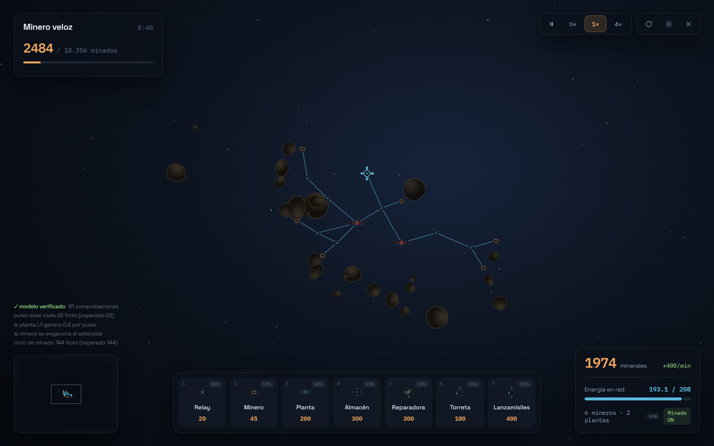</a>

## Jugar

```bash
npm start
```

Abre <http://localhost:8123>. Requiere Node ≥ 18; no hay dependencias ni paso
de compilación.

## Verificar

```bash
npm run check
```

Corre 61 aserciones que comparan el modelo de la red (`web/sim.js`) con el
oráculo de referencia. Las mismas aserciones corren dentro de la página y
pintan el resultado abajo a la izquierda.

## Principios

- **Ningún número se inventa.** Todo valor de balance sale del AS2 decompilado
  (`DATA/SWF/scripts/`) y se cita con `archivo:línea`. Lo no verificado se marca
  como tal.
- **Fidelidad sobre intuición.** Las rarezas del original se reproducen y se
  comentan: el campo de asteroides pasa grados donde espera radianes, se drena
  primero la fuente de energía más lejana, la mejora de la reparadora deja su
  valor en `NaN`. No son bugs del port.
- **Solo JavaScript**, módulos ES cargados tal cual por el navegador. El
  servidor es `node:http`.
- **Todo en español**: código, comentarios, interfaz y documentación.

## Estructura

| | |
|---|---|
| `web/sim.js` | El modelo: red de energía, edificios, naves, proyectiles. Sin DOM. |
| `web/balance.js` | Tablas de datos, `PM_PRNG`, generador del campo, niveles y oleadas |
| `web/main.js` | Render SVG, entrada, HUD. Solo dibuja lo que dice el modelo. |
| `web/sonido.js` | Efectos y las tres pistas de música del SWF |
| `web/comprobaciones.js` | Las 61 aserciones; `check.js` las lanza desde la CLI |
| `GDD.md` | Especificación completa con los valores reales y sus citas |
| `TODO.md` | Estado del port y lo que falta |
| `CLAUDE.md` | Reglas de trabajo y trampas ya pisadas |
| `design/` | Canvas de diseño de sprites y pantallas; `web/sprites.svg` se copia de aquí |
| `DATA/SWF/scripts/` | AS2 decompilado — la fuente de la verdad |
| `DATA/Python/` | Oráculo de referencia con el que se verificó el modelo. No es runtime. |

## Diseño

Los sprites y pantallas están dibujados como SVG en canvas de diseño
(`design/*.dc.html`, se abren en el navegador). `web/sprites.svg` copia sus
`<symbol>` literalmente: si cambia un sprite, cambia aquí primero.

**Assets**

<table><tr><td align="center"><a href="design/Edificios.dc.html">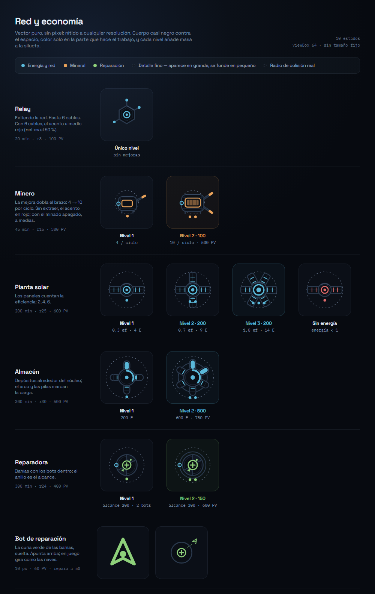</a><br><sub>Edificios</sub></td><td align="center"><a href="design/Armas.dc.html">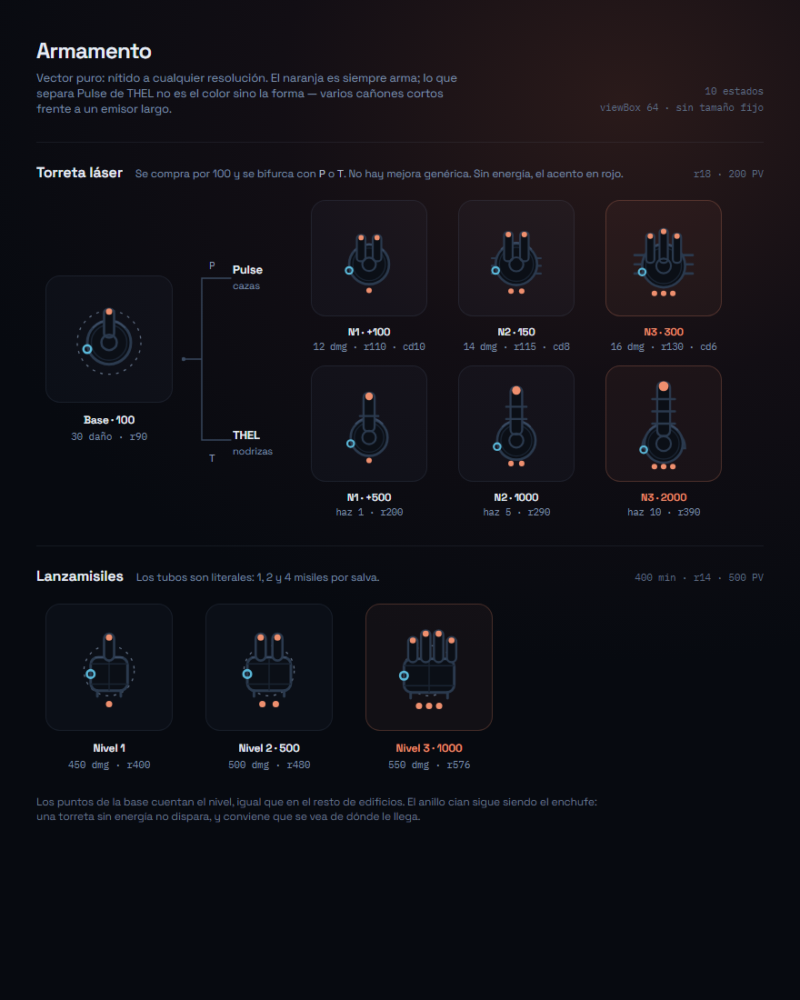</a><br><sub>Armas</sub></td><td align="center"><a href="design/Enemigos.dc.html">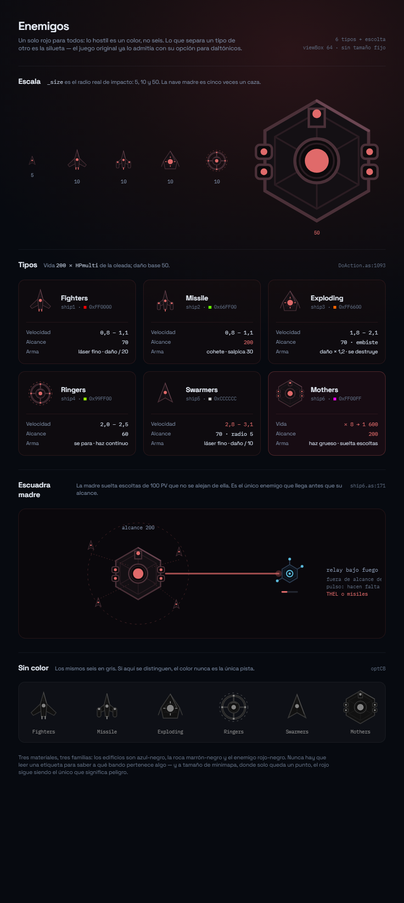</a><br><sub>Enemigos</sub></td><td align="center"><a href="design/Asteroides.dc.html">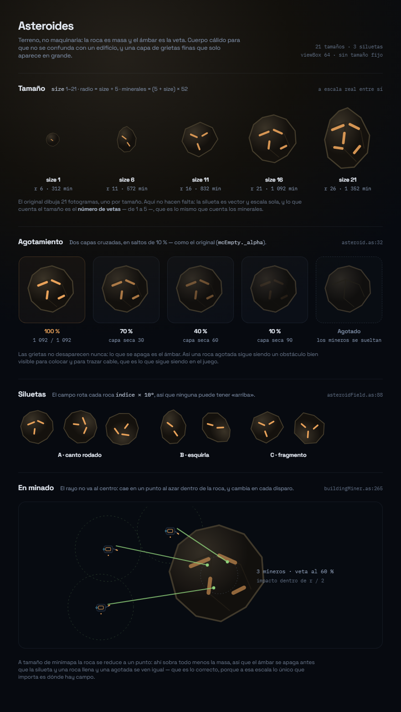</a><br><sub>Asteroides</sub></td></tr>
<tr><td align="center"><a href="design/Efectos.dc.html">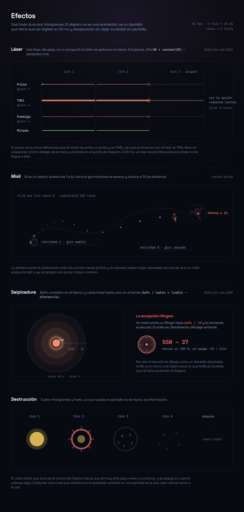</a><br><sub>Efectos</sub></td><td align="center"><a href="design/Estados.dc.html">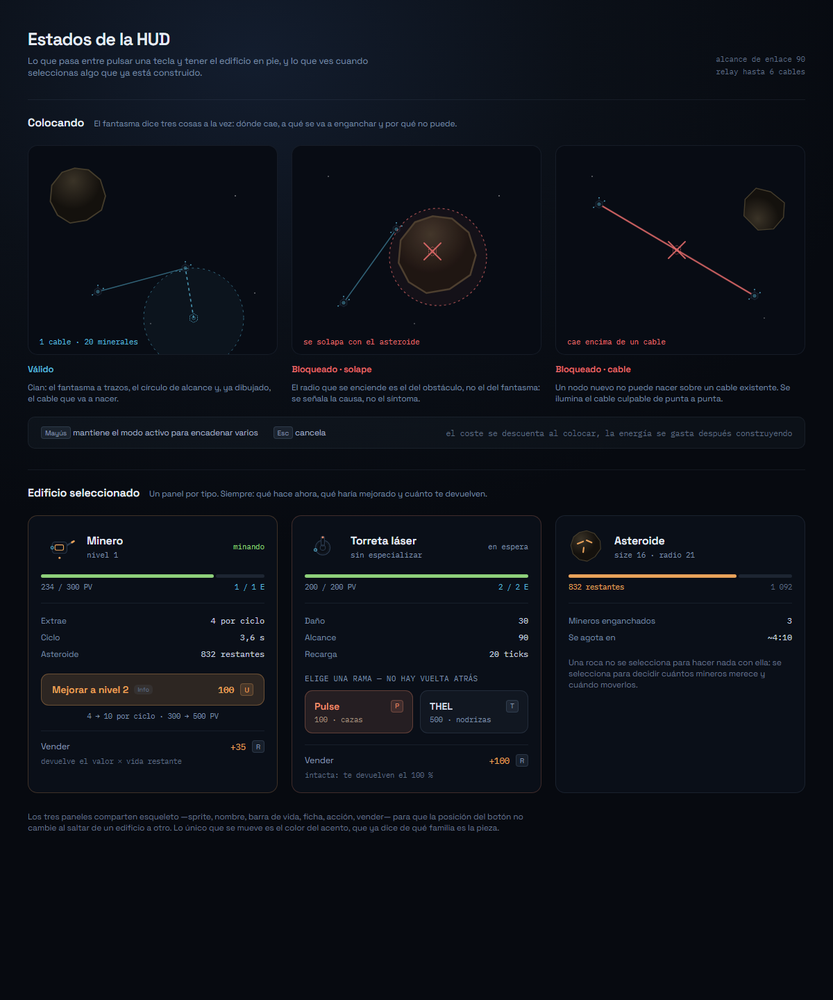</a><br><sub>Estados</sub></td><td align="center"><a href="design/Avisos.dc.html">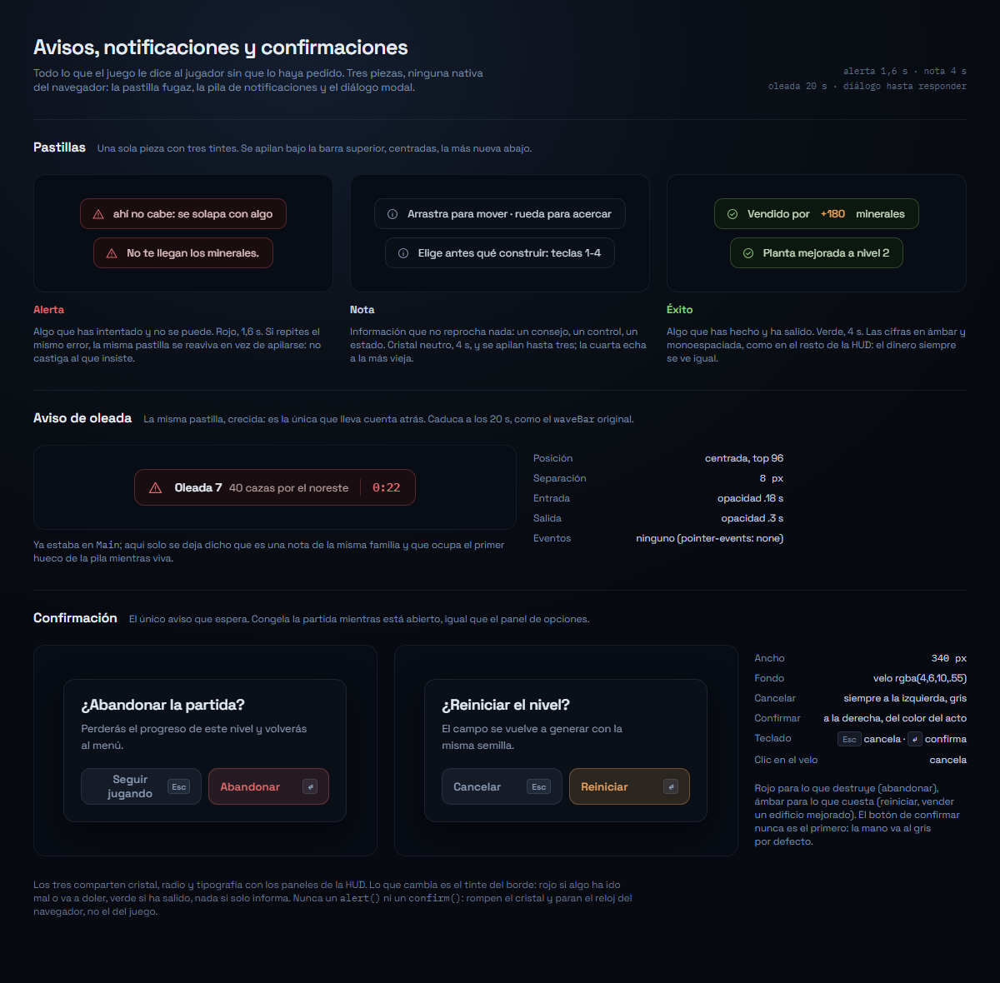</a><br><sub>Avisos</sub></td><td align="center"><a href="design/Escala.dc.html">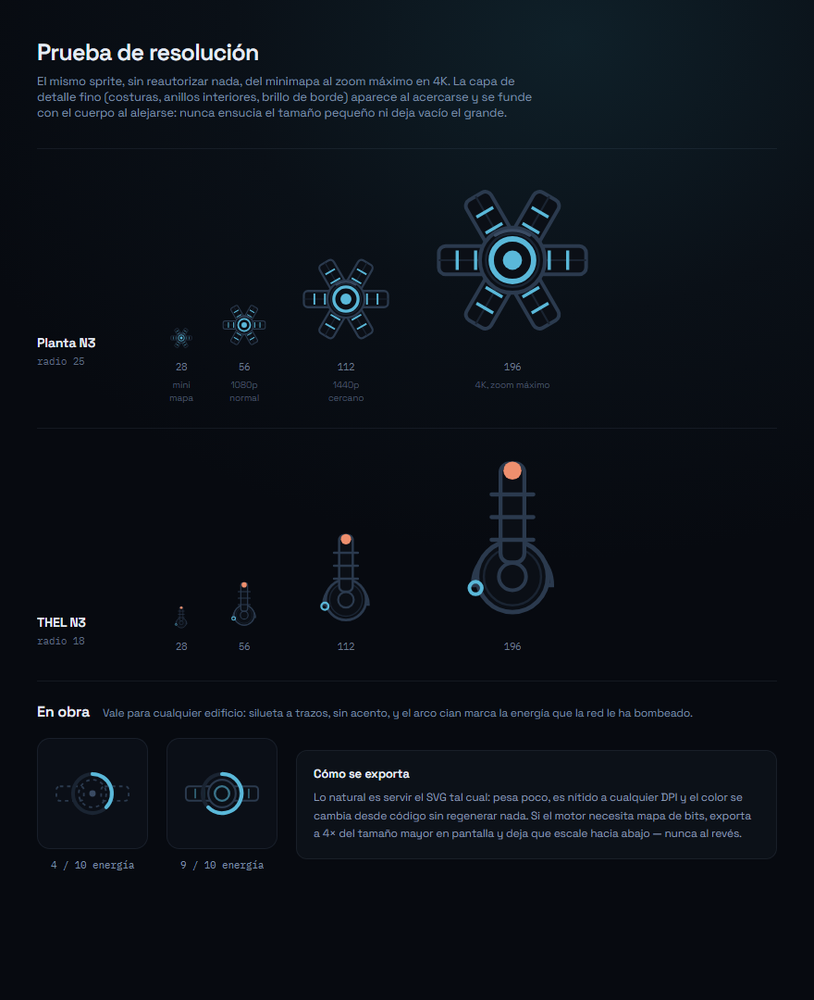</a><br><sub>Escala</sub></td></tr></table>

**Pantallas**

<table><tr><td align="center"><a href="design/Main.dc.html">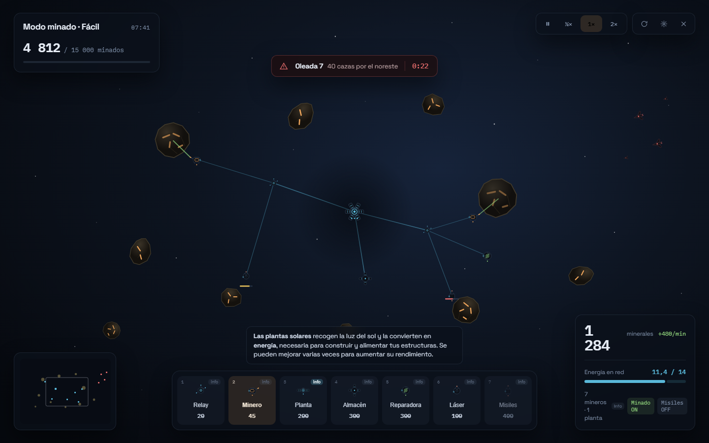</a><br><sub>Main</sub></td><td align="center"><a href="design/Menu.dc.html">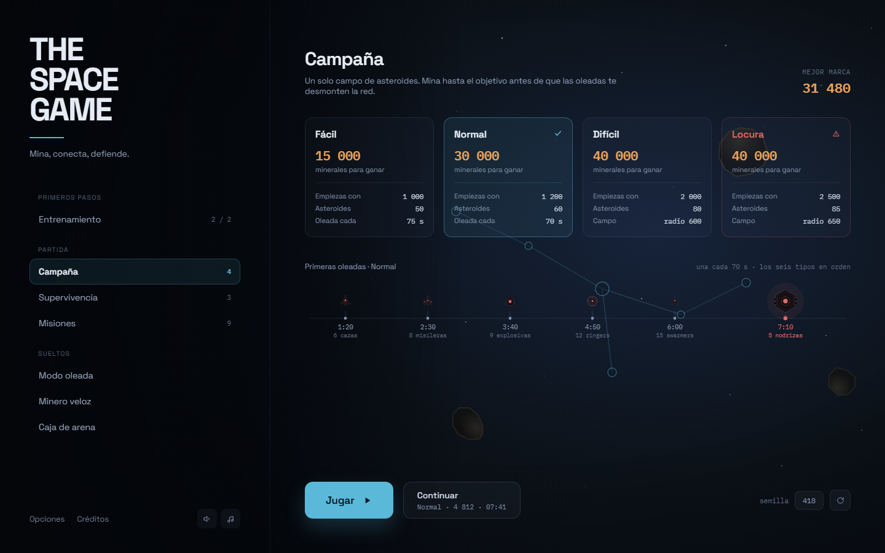</a><br><sub>Menu</sub></td></tr>
<tr><td align="center"><a href="design/FinVictoria.dc.html">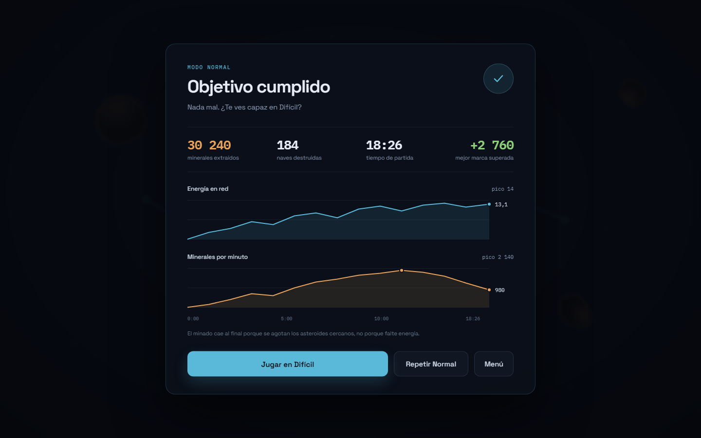</a><br><sub>FinVictoria</sub></td><td align="center"><a href="design/FinDerrota.dc.html">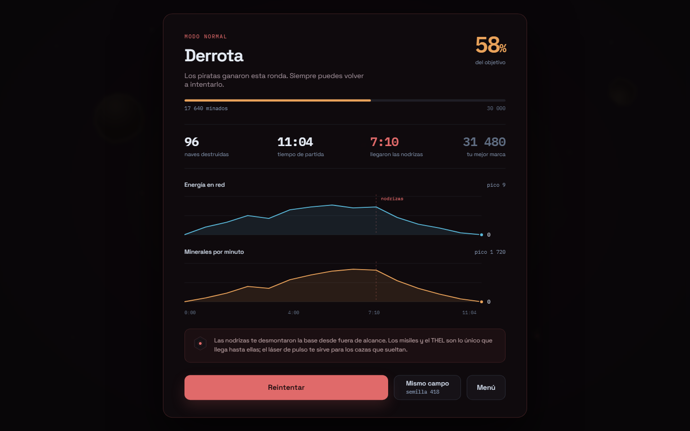</a><br><sub>FinDerrota</sub></td></tr></table>

Las capturas se regeneran con `npm run capturas` (Chrome headless); la del juego
de arriba, con `npm run captura-juego` sobre `npm start` en marcha.

## Estado

Jugable de principio a fin: red de energía, los siete edificios, los siete
tipos de nave, los modos y misiones del original, menú y pantallas de fin,
audio. El detalle está en [`TODO.md`](TODO.md) y lo que **no** se va a portar
(anti-trampas `SecNum`, integración con el portal `CCAPI`) al final del mismo.

## Créditos

Juego original de Casual Collective. Este repositorio no incluye el SWF ni lo
modifica; contiene una reimplementación independiente y los recursos
extraídos para verificarla.
